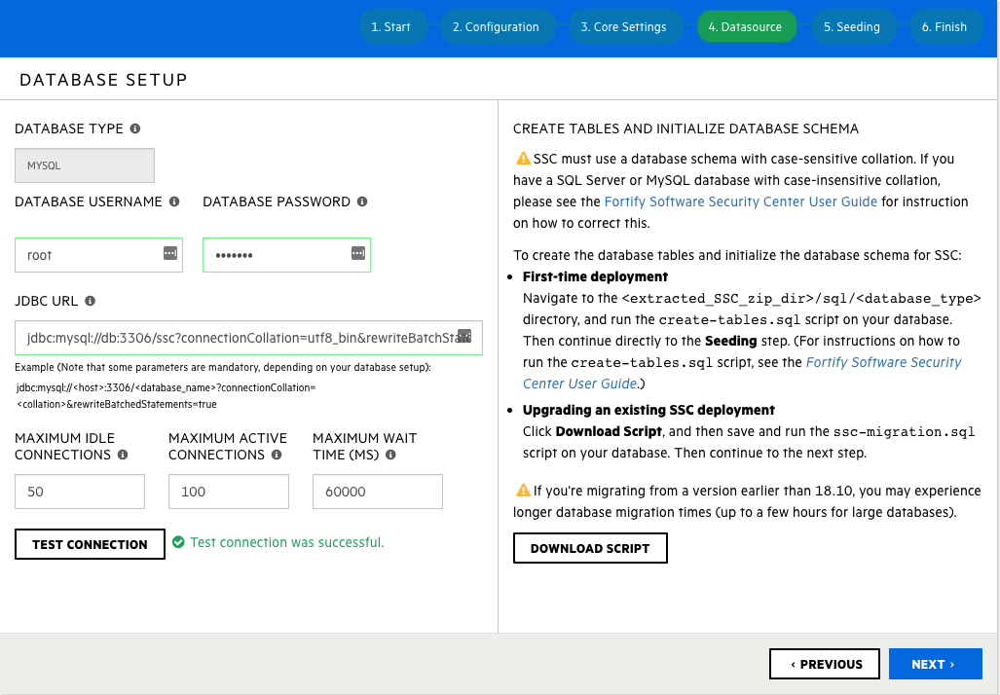
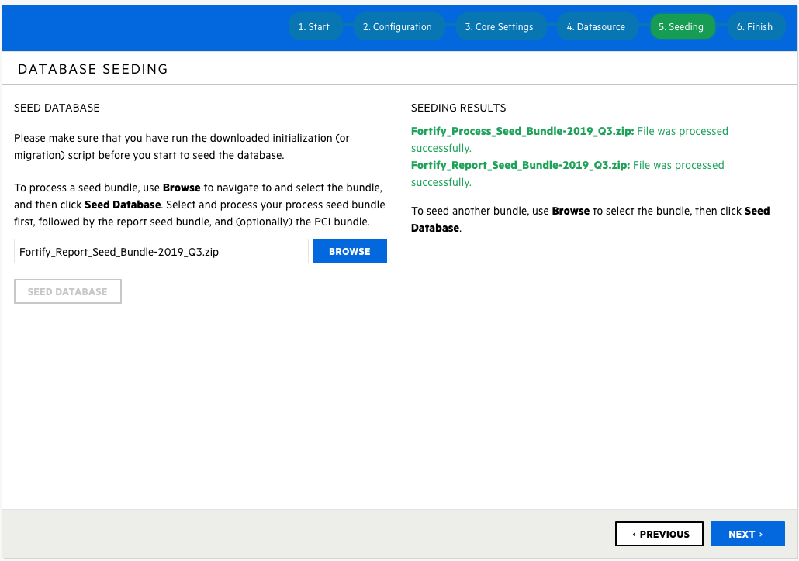
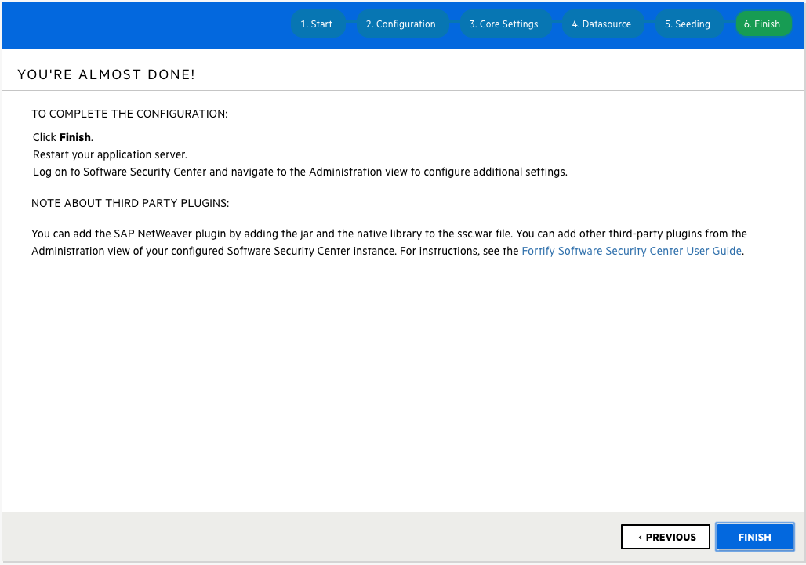
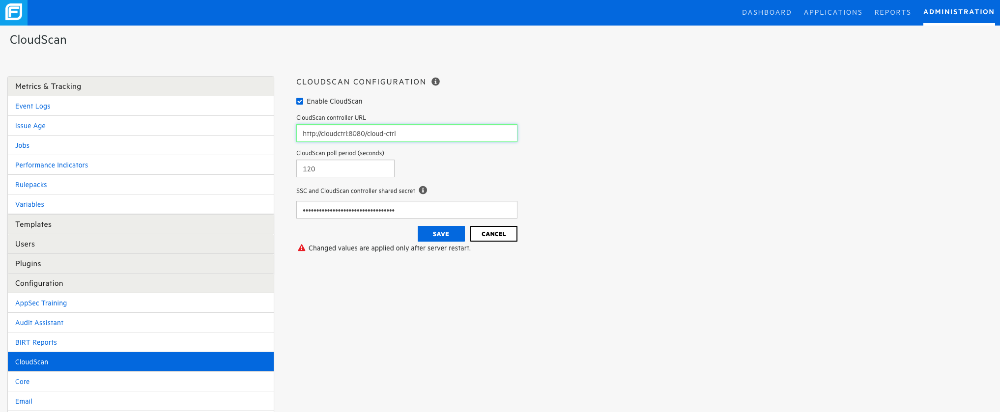

# fortify-ssc-docker
This repo is an example of how to dockerize a Fortify SSC instance with a database server, cloudscan controller and cloudscan sensor. At the time of this exercise, version 19.2.0 was the latest and was used.
# Disclaimer
The constructed environment is **very insecure** and should only be used as an example for testing and demo purposes.

## Containers
### SSC - Dockerfile
This container runs the SSC tomcat web app. It is based on a Centos7 base imagse.
### MySQL - Dockerfile_db
This container runs a mysql instance used as the database server for the SSC webapp. It will be pre-seeded with the SSC schema which will be applied on container startup.
### Cloud Controller - Dockerfile_cc
This container runs the cloud controller webapp.
### Cloud Sensor
This container runs a cloud sensor instance.

## Preconditions
Prior to running any of the build scripts, Fortify SSC should be downloaded and placed in this directory named ```Fortify_SSC_Server_19.2.0.zip``` and Foritfy SCA downloaded and placed in this directory named ```Fortify_SCA_and_Apps_19.2.0_Linux.tar.gz```. Also, your fortify license file should be placed in this directory and named ```fortify.license```. Furthermore, due to licensing, you are required to download the mysql java connector from Oracle which requires an account *sigh*. Download the jar file ```mysql-connector-java-8.0.19.jar``` to this directory

## Prep Directory
Stage all the files for docker to find.
```bash
# prep the create tables script for the docker container
unzip Fortify_SSC_Server_19.2.0.zip
echo "set global sql_mode = 'TRADITIONAL';
set sql_mode = 'TRADITIONAL';
create database ssc character set utf8 collate utf8_bin;
alter database ssc character set utf8 collate utf8_bin;
use ssc;" > create-tables.sql
unzip -p Fortify_19.2.0_Server_WAR_Tomcat.zip sql/mysql/create-tables
.sql >> create-tables.sql
```
## Run with Docker Compose
```bash
docker-compose up

# to rebuild everything,
docker-compose stop -v
docker-compose up --build
```

## Configure the SSC
At this point, all components should be up and running however the SSC requires some configuration. Navigate to the web url in a browser http://localhost:8989/ssc.

You will be required to enter the ```init.token``` as the initial password. This can be collected by running the following command:
```
docker exec -it fortify-ssc-docker_ssc_1 find / -name "init.token" -exec cat {} \;
```
Then enter it into the UI


Next click through the next screens, uploading the license file and setting the SSC URL until the MySQL configuration page. Enter the following values;
 * username: root
 * password: fortify
 * JDBC URL: jdbc:mysql://db:3306/ssc?connectionCollation=utf8_bin&rewriteBatchedStatements=true
 

Now, seed the Process and Report seed files extracted from the main SSC zip file.


After seeing is complete, click through the screens until it says to restart the ssc


Restart the SSC by kill the main process and letting ```docker-compose``` restart the container
```bash
docker exec -it fortify-ssc-docker_ssc_1 kill 1
```

Once the SSC, is backup, navigate back to the main page [http://localhost:8989/ssc](http://localhost:8989/ssc). Login in with the default credentials of admin:admin and when prompted set a new password.

Once into the main UI, navigate to Administration -> Configuration -> Cloudscan and select enable and set the host to cloudctrl, then restart the ssc again.


```bash
#restart again
docker exec -it fortify-ssc-docker_ssc_1 kill 1
```

At this point, the SSC, Database, Cloud Controller and Cloud Sensor should all be online and communicating with each other.


